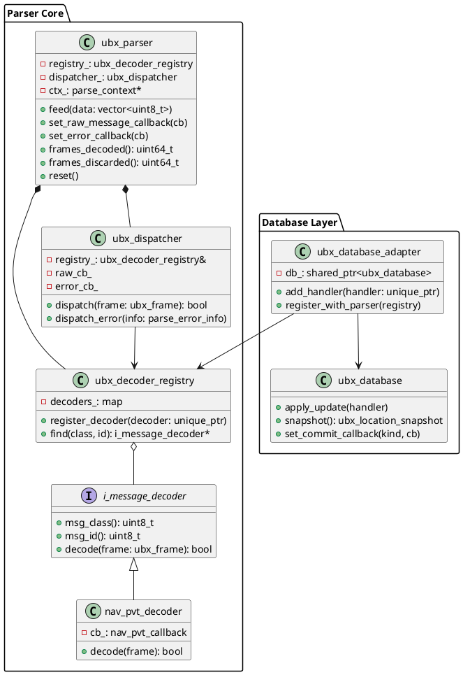
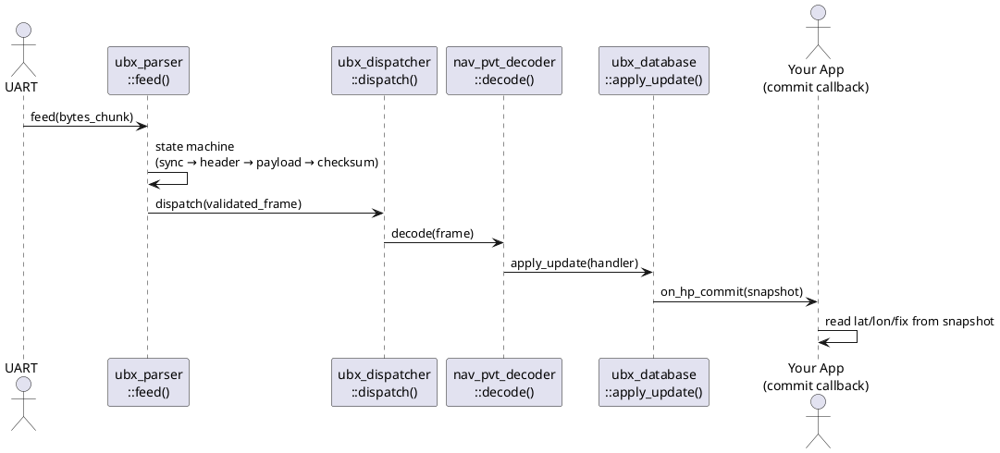

# UBX Protocol & ubx_parser — Workshop Documentation

> **Target audience:** GNSS newcomers — developers new to location services who want to understand UBX binary protocol and quickly integrate the `ubx_parser` C++ library.

---

## Table of Contents

### Part 1 — UBX Protocol: Theory
1. [What is UBX Protocol?](#1-what-is-ubx-protocol)
2. [UBX Message Frame Structure](#2-ubx-message-frame-structure)
3. [Message Classes and IDs](#3-message-classes-and-ids)
4. [Payload Structure](#4-payload-structure)
5. [Checksum Algorithm — Fletcher-8](#5-checksum-algorithm--fletcher-8)
6. [Communication Interface Basics](#6-communication-interface-basics)
7. [Key Concepts Glossary](#7-key-concepts-glossary)

### Part 2 — ubx_parser Library: Developer Guide
8. [Library Overview](#8-library-overview)
9. [Architecture Overview](#9-architecture-overview)
10. [Quick Start: Parsing Your First Message](#10-quick-start-parsing-your-first-message)
11. [Feeding Data into the Parser](#11-feeding-data-into-the-parser)
12. [Registering Message Handlers / Callbacks](#12-registering-message-handlers--callbacks)
13. [Accessing Decoded Message Fields](#13-accessing-decoded-message-fields)
14. [Sending UBX Messages](#14-sending-ubx-messages)
15. [Error Handling](#15-error-handling)
16. [Integration Examples](#16-integration-examples)
17. [Common Pitfalls & Tips](#17-common-pitfalls--tips)

---

---

# Part 1 — UBX Protocol: Theory

> This part is a beginner-friendly protocol reference. Read it first to understand what UBX is, why it exists, and how its messages are structured — before you write a single line of code.

---

## 1. What is UBX Protocol?

> The u-blox (UBX) protocol is a proprietary, binary, and compact communication protocol designed by u-blox to efficiently communicate with their GNSS/GPS receivers.

### The problem it solves

Imagine you have a tiny GNSS receiver soldered on a circuit board. It knows exact position, speed, and time — computed from satellite signals. Your computer needs that data.

But how does the chip talk to applications? It sends bytes over a wire (typically a UART serial port). Without a defined format, those bytes are just noise. **UBX is the agreed language** — a binary protocol that tells both sides exactly how each message is structured.

> **Analogy:** UBX is like an envelope standard for letters. Both the sender and receiver agree that every envelope has a stamp in the top-right corner, a return address, and a recipient address. Without the standard, no one could reliably open and read the mail.

### What UBX does

UBX messages have three roles:

1. **Output** — the GNSS chip periodically sends navigation data (position, velocity, time, satellite status) to host computer.
2. **Commands** — the host sends configuration commands to control the chip (e.g., "give me position at 10 Hz instead of 1 Hz").
3. **Acknowledgements** — after every command, the chip replies with `UBX-ACK-ACK` (accepted) or `UBX-ACK-NAK` (rejected), so you always know whether your command worked.

### UBX vs. NMEA — which should you use?

You may have heard of **NMEA 0183** — the text-based GPS protocol. Here is a direct comparison:

| Aspect | UBX | NMEA 0183 |
|---|---|---|
| Format | Binary | ASCII text (human-readable) |
| Primary purpose | Full receiver control + rich data output | Simple navigation sentences |
| Can configure the receiver | **Yes** — the only way on u-blox chips | No |
| Data richness | Very high (raw measurements, sensor fusion, diagnostics) | Low (position, speed, heading) |
| Parser complexity | Requires a binary state machine | Simple string splitting |
| Bandwidth efficiency | Compact binary | 3–4× larger than equivalent UBX |

**Use NMEA when:**
- Need quick human-readable output for debugging.
- A third-party tool only accepts NMEA.
- O`nly need basic latitude/longitude/speed.

**Use UBX when:**
- Need to configure the receiver (message rates, port settings, etc.).
- Need high-rate, high-precision data (carrier phase, IMU fusion, accuracy estimates).
- Need to write production software that must be efficient and deterministic.

> **Key takeaway:** On u-blox chips, configuration is **only possible through UBX**. NMEA is output-only. If we want to change anything on the chip, we must speak UBX.

---

## 2. UBX Message Frame Structure

### Every UBX message looks the same on the outside

No matter what data is inside, every UBX message follows the same byte layout.  Think of it like a universal shipping box: the outside always has the same labels, only the contents differ.

### Frame layout

```
Byte index:   0      1      2       3     4       5       6 … N+5   N+6    N+7
              ┌──────┬──────┬───────┬─────┬───────┬───────┬─────────┬──────┬──────┐
              │ 0xB5 │ 0x62 │ Class │  ID │ Len_L │ Len_H │ Payload │ CK_A │ CK_B │
              └──────┴──────┴───────┴─────┴───────┴───────┴─────────┴──────┴──────┘
               Sync1   Sync2  ──────── Header ──────────── ─ Payload ─  Checksum
```

Where `N` is the declared payload length in bytes.

### Field-by-field description

| Field | Size | Value | Purpose |
|---|---|---|---|
| **Sync Char 1** | 1 byte | Always `0xB5` | Marks the start of a UBX frame |
| **Sync Char 2** | 1 byte | Always `0x62` | Together with Sync 1, this two-byte sequence uniquely identifies UBX |
| **Class** | 1 byte | e.g. `0x01` | Message group (NAV, CFG, ACK, …) |
| **ID** | 1 byte | e.g. `0x07` | Specific message within the group |
| **Length** | 2 bytes | Little-endian U2 | Number of bytes in the payload (0 to 65 535) |
| **Payload** | 0–65 535 bytes | Message-specific | The actual data content |
| **CK_A** | 1 byte | Computed | First Fletcher-8 checksum byte |
| **CK_B** | 1 byte | Computed | Second Fletcher-8 checksum byte |

**Minimum frame size:** 8 bytes (zero-length payload — used for poll requests).  
**Overhead:** 8 bytes of framing around every payload.

### Real example: polling NAV-PVT (asking for a position fix)

A "poll request" asks the chip to send one NAV-PVT message immediately. It has **no payload** — just a header and checksum:

```
Byte:   0     1     2     3     4     5     6     7
      ┌─────┬─────┬─────┬─────┬─────┬─────┬─────┬─────┐
      │ B5  │ 62  │ 01  │ 07  │ 00  │ 00  │ 08  │ 19  │
      └─────┴─────┴─────┴─────┴─────┴─────┴─────┴─────┘
       Sync  Sync  NAV  PVT  Len=0  Len=0  CK_A  CK_B
```

- `0x01` = NAV class, `0x07` = PVT message ID
- `0x00 0x00` = zero-length payload (little-endian)
- `0x08 0x19` = computed checksum

---

## 3. Message Classes and IDs

### The class/ID naming system

Every UBX message is identified by a **two-byte pair: (Class, ID)**.

- **Class** = the module or topic area (like a chapter in a book)
- **ID** = the specific message within that chapter

For example, `UBX-NAV-PVT` means:
- Class `0x01` = NAV (navigation)
- ID `0x07` = PVT (Position, Velocity, Time)

### Common message classes

| Class Byte | Name | What it covers |
|---|---|---|
| `0x01` | **NAV** | Navigation results: position, velocity, time, satellite info |
| `0x02` | **RXM** | Receiver Manager: raw signal measurements |
| `0x04` | **INF** | Informational: human-readable debug/warning strings from the chip |
| `0x05` | **ACK** | Acknowledgements: confirms or rejects commands |
| `0x06` | **CFG** | Configuration: VALGET, VALSET, VALDEL, CFG-RST |
| `0x09` | **UPD** | Update / Save-on-Shutdown |
| `0x0A` | **MON** | Monitoring: hardware diagnostics, I/O stats, firmware version |
| `0x0D` | **TIM** | Timing: timepulse data |
| `0x10` | **ESF** | External Sensor Fusion: wheel tick, IMU, dead-reckoning |
| `0x27` | **SEC** | Security: jamming/spoofing detection |
| `0x29` | **NAV2** | Secondary navigation (dual-instance receivers) |

### Commonly used messages

| Message | Class | ID | Size | What it contains |
|---|---|---|---|---|
| **NAV-PVT** | `0x01` | `0x07` | 92 bytes | Position + Velocity + Time — the main navigation message |
| **NAV-SAT** | `0x01` | `0x35` | Variable | Per-satellite signal strength and health |
| **NAV-STATUS** | `0x01` | `0x03` | 16 bytes | Receiver navigation status and startup mode |
| **NAV-DOP** | `0x01` | `0x04` | 18 bytes | Dilution of Precision (HDOP, VDOP, etc.) |
| **NAV-TIMEUTC** | `0x01` | `0x21` | 20 bytes | UTC time solution |
| **NAV-CLOCK** | `0x01` | `0x22` | 20 bytes | Receiver clock bias and drift |
| **NAV-ATT** | `0x01` | `0x05` | 32 bytes | Vehicle attitude: roll, pitch, heading |
| **MON-VER** | `0x0A` | `0x04` | Variable | Firmware version and protocol version |
| **ACK-ACK** | `0x05` | `0x01` | 2 bytes | Command accepted |
| **ACK-NAK** | `0x05` | `0x00` | 2 bytes | Command rejected |
| **CFG-VALSET** | `0x06` | `0x8A` | Variable | Write configuration key-value pairs |
| **CFG-VALGET** | `0x06` | `0x8B` | Variable | Read configuration key-value pairs |

---

## 4. Payload Structure

### Reading the specification tables

The u-blox Interface Description document lists each message's payload in a table like this (example from NAV-PVT):

| Offset | Name | Type | Description |
|---|---|---|---|
| 0 | iTOW | U4 | GPS time of week [ms] |
| 4 | year | U2 | UTC year [1–9999] |
| 6 | month | U1 | UTC month [1–12] |
| 7 | day | U1 | UTC day [1–31] |
| 20 | fixType | U1 | GNSS fix type |
| 24 | lon | I4 | Longitude [1e-7 deg] |
| 28 | lat | I4 | Latitude [1e-7 deg] |

- **Offset** = byte position from the start of the payload (0 = first payload byte)
- **Type** = data type of the field (see table below)
- Reading fields means: go to `payload[offset]` and interpret the next `sizeof(type)` bytes

### UBX field types

| Type | Size | Meaning |
|---|---|---|
| `U1` | 1 byte | Unsigned 8-bit integer (0–255) |
| `U2` | 2 bytes | Unsigned 16-bit integer |
| `U4` | 4 bytes | Unsigned 32-bit integer |
| `U8` | 8 bytes | Unsigned 64-bit integer |
| `I1` | 1 byte | Signed 8-bit integer (−128 to +127) |
| `I2` | 2 bytes | Signed 16-bit integer |
| `I4` | 4 bytes | Signed 32-bit integer |
| `I8` | 8 bytes | Signed 64-bit integer |
| `X1` | 1 byte | 8-bit bitfield (use bit masks to extract individual flags) |
| `X2` | 2 bytes | 16-bit bitfield |
| `X4` | 4 bytes | 32-bit bitfield |
| `R4` | 4 bytes | IEEE 754 single-precision float |
| `R8` | 8 bytes | IEEE 754 double-precision float |
| `CH` | 1 byte | ASCII character |

### Little-endian byte order — the most important rule

All multi-byte values in UBX are stored **little-endian**: the **least significant byte comes first**.

> **Analogy:** Think of writing the number 1000 as "000 1" (units first, then thousands).

**Example — reading a U4 at offset 0 (e.g. iTOW = 400 000 ms):**

The 4 bytes on the wire:
```
payload[0] = 0x40
payload[1] = 0x1A
payload[2] = 0x06
payload[3] = 0x00
```

Reconstruct the value: `0x00` `0x06` `0x1A` `0x40` = **`0x00061A40`** = **400 000** ✓

**Correct C++ code:**
```cpp
uint32_t itow = static_cast<uint32_t>(payload[0])
              | (static_cast<uint32_t>(payload[1]) <<  8u)
              | (static_cast<uint32_t>(payload[2]) << 16u)
              | (static_cast<uint32_t>(payload[3]) << 24u);
```

**Wrong — do not do this:**
```cpp
// UNDEFINED BEHAVIOUR: alignment violation and strict aliasing violation
uint32_t itow = *reinterpret_cast<uint32_t*>(&payload[0]);
```

> **Warning:** Always use explicit shift-and-OR to read multi-byte fields. Never cast a raw pointer to a wider integer type.

### Scaling — fields are often integers with a scale factor

Many fields store a physical quantity as a scaled integer to avoid floating-point in the protocol:

| Field | Type | Raw value means | To get real value |
|---|---|---|---|
| `lat` | I4 | degrees × 10⁷ | divide by `1e7` |
| `lon` | I4 | degrees × 10⁷ | divide by `1e7` |
| `height` | I4 | millimetres | divide by `1000.0` for metres |
| `hAcc` | U4 | millimetres | divide by `1000.0` for metres |
| `headMot` | I4 | degrees × 10⁵ | divide by `1e5` |

---

## 5. Checksum Algorithm — Fletcher-8

### Why checksums matter

When bytes travel over a UART wire, electrical noise can flip a bit. A checksum is a quick mathematical test that catches most transmission errors. UBX uses a variant of the **Fletcher-8** algorithm.

### How it works

The checksum runs over every byte from the **Class byte** to the **last payload byte** (the sync bytes are excluded). It produces two output bytes: `CK_A` and `CK_B`.

**Algorithm:**
```
CK_A = 0
CK_B = 0
for each byte b in [Class, ID, Len_L, Len_H, Payload...]:
    CK_A = (CK_A + b) mod 256
    CK_B = (CK_B + CK_A) mod 256
```

Both values stay in the range 0–255 (one byte each). The "mod 256" part happens naturally if they are stored in `uint8_t` variables.

### Worked example — NAV-PVT poll frame

Bytes covered: `[0x01, 0x07, 0x00, 0x00]` (Class, ID, Len_L, Len_H — no payload)

| Step | Byte processed | CK_A | CK_B |
|---|---|---|---|
| Start | — | `0x00` | `0x00` |
| Class | `0x01` | `0x01` | `0x01` |
| ID | `0x07` | `0x08` | `0x09` |
| Len_L | `0x00` | `0x08` | `0x11` |
| Len_H | `0x00` | `0x08` | `0x19` |

**Result:** `CK_A = 0x08`, `CK_B = 0x19`  
Complete frame: `B5 62 01 07 00 00 08 19` ✓

### C++ implementation

```cpp
void compute_checksum(const uint8_t* data, std::size_t len,
                      uint8_t& ck_a, uint8_t& ck_b)
{
    ck_a = 0u;
    ck_b = 0u;
    for (std::size_t i = 0u; i < len; ++i)
    {
        ck_a = static_cast<uint8_t>(ck_a + data[i]);
        ck_b = static_cast<uint8_t>(ck_b + ck_a);
    }
}
// Call with: data = &frame[2] (start at Class byte), len = 4 + payload_length
```

### Common checksum mistakes

| Mistake | What goes wrong |
|---|---|
| Including the sync bytes (`0xB5 0x62`) in the checksum | Computed value never matches; every frame is rejected |
| Starting checksum at payload start (skipping Class/ID/Length) | Different messages with identical payloads would be confused |
| Using a 16-bit or 32-bit accumulator without truncating to 8 bits | Overflow produces wrong values |
| Only checking `CK_A` | Misses errors that cancel out in `CK_A` but not in `CK_B` |

---

## 6. Communication Interface Basics

### Physical interfaces

u-blox F9-class chips can communicate over four interfaces:

| Interface | Typical use case | Notes |
|---|---|---|
| **UART** | Automotive, embedded OEM boards | Full-duplex serial; most common; shares the wire with NMEA output |
| **USB** (CDC-ACM) | PC development, lab testing | Appears as a virtual COM port (`/dev/ttyACM0` on Linux) |
| **SPI** | High-speed embedded systems | Chip-select framed; requires periodic polling for incoming data |
| **I²C** | Low-speed microcontrollers | Register-based; slower; less common |

### Three interaction patterns

**Pattern 1 — Periodic output (chip → host)**

The chip sends navigation data at a regular rate you configure. Most messages are off by default (rate = 0) and you must enable them via `CFG-VALSET`.

```
Chip  ──►  UBX-NAV-PVT   (every 200 ms if rate = 5 Hz)
Chip  ──►  UBX-NAV-SAT   (every 1 s if rate = 1 Hz)
```

**Pattern 2 — Poll request / poll response (host → chip → host)**

Your host sends an empty frame (zero payload) with the Class/ID of the message it wants. The chip replies immediately with one instance.

```
Host  ──►  B5 62 01 07 00 00 08 19        (poll NAV-PVT)
Chip  ◄──  B5 62 01 07 5C 00 [92 bytes] [CK_A] [CK_B]   (NAV-PVT response)
```

**Pattern 3 — Command + ACK/NAK (host → chip → host)**

Your host sends a configuration command. The chip confirms or rejects with a 2-byte ACK payload that echoes back the Class and ID of your command.

```
Host  ──►  UBX-CFG-VALSET  (set measurement rate = 200 ms)
Chip  ◄──  UBX-ACK-ACK     (payload: 0x06 0x8A — echoes CFG-VALSET class/id)
```

> **Warning:** Always wait for `ACK-ACK` before sending the next command. If you receive `ACK-NAK`, the command was **rejected** — check the key ID and value format.

### Configuration with VALSET/VALGET (F9-class chips)

F9-class chips use a **key-value** configuration model. Every setting has a 32-bit key ID.

| Command | Direction | What it does |
|---|---|---|
| **CFG-VALGET** (class `0x06`, ID `0x8B`) | Host → chip → host | Read the current value of a key |
| **CFG-VALSET** (class `0x06`, ID `0x8A`) | Host → chip | Write a new value to a key |
| **CFG-VALDEL** (class `0x06`, ID `0x8C`) | Host → chip | Reset a key to its firmware default |

**Configuration layers** (each key-value lives in a stack):

| Layer | Lifetime |
|---|---|
| **RAM** | Lost on power cycle or software reset |
| **BBR** (Battery-Backed RAM) | Survives software reset; lost when power is fully removed |
| **Flash** | Truly permanent; survives power loss |

**Example — enable NAV-PVT at 5 Hz:**
1. Key ID for `CFG-MSGOUT-UBX_NAV_PVT_UART1` = output rate on UART1 port.
2. Build a VALSET frame with that key set to `1` (once per epoch), targeting RAM layer.
3. Send it; wait for `ACK-ACK`.
4. Separately, set `CFG-RATE-MEAS` (key `0x30210001`) to `200` (200 ms = 5 Hz).

---

## 7. Key Concepts Glossary

| Term | Definition |
|---|---|
| **GNSS** | Global Navigation Satellite System — the generic term for all satellite positioning systems: GPS (USA), GLONASS (Russia), Galileo (EU), BeiDou (China). A receiver determines position by measuring signal travel times from multiple satellites. |
| **UBX** | The proprietary binary protocol used by u-blox GNSS chips for all host↔receiver communication. |
| **NMEA** | A text-based GPS output protocol (`$GNRMC`, `$GNGGA`, etc.). Output-only; cannot configure a u-blox receiver. |
| **RTCM** | A binary correction data protocol for RTK (high-precision) positioning. Not used for receiver configuration. |
| **Epoch** | One complete navigation computation cycle. All messages from the same computation share the same iTOW value. |
| **iTOW** | GPS Time Of Week — the timestamp for navigation data, in milliseconds since the start of the current GPS week. |
| **Fix** | A successful position computation. A fix is only usable when the `gnssFixOK` flag is set in NAV-PVT. |
| **PVT** | Position, Velocity, Time — the canonical combined GNSS output. `UBX-NAV-PVT` is the primary message. |
| **Payload** | The data content of a UBX frame, not including sync bytes, header, or checksum. |
| **Little-endian** | Byte order where the least significant byte is stored first. All multi-byte UBX integers use this order. |
| **CK_A / CK_B** | Two-byte Fletcher-8 checksum appended to every UBX frame to detect transmission errors. |
| **Poll** | A zero-payload UBX frame sent to request an immediate one-shot response from the chip. |
| **ACK / NAK** | Acknowledgement (success) / Negative Acknowledgement (rejected) sent after every command. |
| **VALSET / VALGET** | The F9-generation key-value configuration interface for writing/reading chip settings. |
| **BBR** | Battery-Backed RAM — chip memory that survives software resets but not full power loss. |
| **SV** | Space Vehicle — the formal name for a GNSS satellite. |
| **CNO** | Carrier-to-Noise density ratio — a measure of signal strength for a satellite, in dB-Hz. |

---

---

# Part 2 — ubx_parser Library: Developer Guide

> This part is a practical guide for integrating the `ubx_parser` C++ library into your application. Read Part 1 first to understand the protocol before using the library.

---

## 8. Library Overview

### What ubx_parser does

`ubx_parser` is a C++ library that does exactly one job: it takes a **raw byte stream** from a GNSS UART and turns it into **decoded C++ structs** that your application can use.

You hand it chunks of bytes from your serial port. It takes care of:
- Finding where each UBX frame starts and ends (frame synchronisation)
- Verifying the checksum (so corrupt frames are discarded)
- Routing each valid frame to the right decoder
- Calling your callback with the decoded data

### Design philosophy

| Principle | What it means in practice |
|---|---|
| **Streaming state machine** | Feed bytes in any chunk size — the parser preserves state between calls |
| **Zero-copy decoding** | The decoder reads directly from the frame buffer; no extra copies |
| **Open/Closed** | Add new message types by registering a new decoder — the parser core never changes |
| **Defensive limits** | Reject oversized frames (>4 096 bytes by default) before allocating memory |
| **Not thread-safe by design** | Clear ownership model: one thread owns the parser; cross-thread data flows via the database layer |

### The library is more than just a parser

`ubx_parser` includes several cooperating subsystems:

```
┌─────────────────────────────────────────────────────────────────┐
│                       ubx_parser library                        │
│                                                                 │
│  ┌─────────────┐    ┌──────────────────┐    ┌────────────────┐  │
│  │  Parser     │    │  Database layer  │    │  Config layer  │  │
│  │  (core)     │───►│  (field store +  │    │  (VALSET /     │  │
│  │             │    │   snapshots)     │    │   VALGET mgmt) │  │
│  └─────────────┘    └──────────────────┘    └────────────────┘  │
│                                                                 │
│  ┌──────────────────────────────────────────────────────────┐   │
│  │  Message builders  (ubx_message_builder, cfg_rst_builder)│   │
│  └──────────────────────────────────────────────────────────┘   │
└─────────────────────────────────────────────────────────────────┘
```

You can use just the parser core (simple callbacks), or add the database layer (thread-safe field store), or use the config manager to handle VALSET/VALGET cycles.

---

## 9. Architecture Overview

### Parser pipeline

```
 UART read() / DMA callback
         │
         ▼
  ┌─────────────────────────────────┐
  │         ubx_parser::feed()      │
  │  (byte-at-a-time state machine) │
  └──────────────┬──────────────────┘
                 │  Valid frame (checksum OK)
                 ▼
  ┌───────────────────────────────────┐
  │       ubx_dispatcher              │
  │  Looks up (class, id) in registry │
  └──────────┬────────────────────────┘
             │                       │
   Decoder found                No decoder found
             │                       │
             ▼                       ▼
  ┌───────────────────┐   ┌────────────────────────┐
  │  i_message_decoder│   │  raw_message_callback  │
  │  .decode(frame)   │   │  (forward-compat path) │
  └────────┬──────────┘   └────────────────────────┘
           │
           ▼
  ┌───────────────────────┐
  │  Typed callback fires │
  │  e.g. nav_pvt_callback│
  │  with ubx_nav_pvt{}   │
  └───────────────────────┘
```

### Key classes and their responsibilities

| Class | Header | Responsibility |
|---|---|---|
| `ubx_parser` | `ubx_parser.h` | Top-level API: accepts `feed()` calls, runs state machine, owns registry |
| `ubx_decoder_registry` | `ubx_decoder_registry.h` | Maps (class, id) → decoder instance |
| `ubx_dispatcher` | `ubx_dispatcher.h` | Routes validated frames to decoders or raw callback |
| `i_message_decoder` | `decoders/i_message_decoder.h` | Pure-virtual interface every decoder implements |
| `nav_pvt_decoder` | `decoders/nav_pvt_decoder.h` | Example concrete decoder for NAV-PVT |
| `ubx_message_builder` | `ubx_message_builder.h` | Fluent builder to construct outgoing UBX frames |
| `ubx_database` | `database/ubx_database.h` | Thread-safe field store with commit callbacks |
| `ubx_database_adapter` | `database/ubx_database_adapter.h` | Wires parser callbacks into the database |
| `ubx_config_manager` | `config/ubx_config_manager.h` | Manages VALGET/VALSET configuration cycles |

### PlantUML class diagram



### PlantUML sequence diagram — incoming NAV-PVT



---

## 10. Quick Start: Parsing Your First Message

### Minimal complete example

This example shows the simplest possible use of `ubx_parser`: register one decoder, feed in a binary UBX frame, and print the latitude and longitude.

```cpp
#include "ubx_parser.h"
#include "ubx_decoder_registry.h"
#include "ubx_message_builder.h"
#include "decoders/nav_pvt_decoder.h"
#include "messages/ubx_nav_pvt.h"
#include "ubx_errors.h"

#include <cstdio>
#include <memory>
#include <vector>

int main()
{
    using namespace ubx::parser;

    // ── Step 1: Create a decoder registry ────────────────────────────────────
    ubx_decoder_registry registry;

    // ── Step 2: Register a decoder for UBX-NAV-PVT ──────────────────────────
    registry.register_decoder(
        std::unique_ptr<nav_pvt_decoder>(
            new nav_pvt_decoder([](const ubx_nav_pvt& msg) {
                // This lambda is your callback — called on every valid NAV-PVT
                if (msg.flags & ubx_nav_pvt::FLAGS_GNSS_FIX_OK) {
                    double lat = msg.lat * 1e-7;
                    double lon = msg.lon * 1e-7;
                    std::printf("Fix OK: lat=%.7f  lon=%.7f  numSV=%u\n",
                                lat, lon, msg.num_sv);
                } else {
                    std::printf("No fix yet (fixType=%u)\n",
                                static_cast<unsigned>(msg.fix_type));
                }
            })
        )
    );

    // ── Step 3: Create the parser, set an error callback ─────────────────────
    ubx_parser parser(std::move(registry));

    parser.set_error_callback([](const parse_error_info& e) {
        std::printf("[ERROR] %s\n", e.description.c_str());
    });

    // ── Step 4: Build a fake NAV-PVT frame (normally comes from UART) ────────
    std::vector<uint8_t> payload(UBX_NAV_PVT_PAYLOAD_LEN, 0x00u);
    // lat = 10.75 degrees → 10.75 × 1e7 = 107500000
    uint32_t lat_raw = static_cast<uint32_t>(107500000);
    payload[28] = lat_raw & 0xFF;
    payload[29] = (lat_raw >> 8)  & 0xFF;
    payload[30] = (lat_raw >> 16) & 0xFF;
    payload[31] = (lat_raw >> 24) & 0xFF;
    // flags: gnssFixOK = bit 0
    payload[21] = 0x01u;
    // fixType = 3 (3D fix)
    payload[20] = 0x03u;
    // numSV = 8
    payload[23] = 8u;

    auto frame = ubx_message_builder::make_frame(
        UBX_CLASS_NAV, UBX_ID_NAV_PVT, payload);

    // ── Step 5: Feed the frame bytes into the parser ──────────────────────────
    parser.feed(frame);  // Callback fires synchronously inside this call

    // ── Step 6: Check counters ────────────────────────────────────────────────
    std::printf("Decoded: %llu  Discarded: %llu\n",
                static_cast<unsigned long long>(parser.frames_decoded()),
                static_cast<unsigned long long>(parser.frames_discarded()));

    return 0;
}
```

### Step-by-step walkthrough

| Step | What happens |
|---|---|
| Create registry | An empty map that will hold decoder objects |
| Register decoder | Associates (0x01, 0x07) → `nav_pvt_decoder`; the lambda is the callback |
| Create parser | Takes ownership of the registry; allocates internal state machine |
| Set error callback | Optional but recommended — fires on checksum failure, oversized payload, etc. |
| Build frame | `ubx_message_builder::make_frame()` assembles the binary frame with valid checksum |
| Feed bytes | `parser.feed()` runs the state machine; when a complete, valid frame is found, `dispatch()` fires the decoder callback synchronously |
| Check counters | `frames_decoded()` / `frames_discarded()` for health monitoring |

---

## 11. Feeding Data into the Parser

### The `feed()` method

```cpp
void ubx_parser::feed(const std::vector<uint8_t>& data);
```

Call this with **whatever bytes you received from the serial port**. The chunk can be any size:

| Scenario | How the parser handles it |
|---|---|
| Multiple complete frames in one chunk | Each frame is decoded in order |
| One frame split across multiple `feed()` calls | State machine pauses mid-frame and resumes on next call |
| Mixed UBX + NMEA bytes | NMEA and noise bytes are silently skipped |
| Single byte | Works — though inefficient; batch reads are better |

### Partial frame handling is automatic

The state machine runs through these states internally:

```
WAIT_SYNC_1 → WAIT_SYNC_2 → READ_CLASS → READ_ID
     → READ_LEN_L → READ_LEN_H → READ_PAYLOAD → READ_CK_A → READ_CK_B
                                      ↑
                          (stays here until all payload bytes arrive)
```

All in-progress state (which state we are in, how many payload bytes have arrived) lives in the `parse_context` struct, which persists between `feed()` calls. You do not need to manage any buffers yourself.

### Recommended UART read loop

```cpp
std::vector<uint8_t> read_buf(4096);

while (running) {
    ssize_t n = read(uart_fd, read_buf.data(), read_buf.size());
    if (n > 0) {
        read_buf.resize(static_cast<std::size_t>(n));
        parser.feed(read_buf);
        read_buf.resize(4096); // restore capacity for next read
    }
}
```

### Payload size protection

By default, the parser **rejects any frame that declares a payload larger than 4 096 bytes** (`UBX_SAFE_MAX_PAYLOAD_LEN`). This prevents a single malformed frame from causing a 64 KB memory allocation. Override the limit if needed:

```cpp
parser.set_max_payload_length(8192u); // accept up to 8 KB payloads
```

---

## 12. Registering Message Handlers / Callbacks

### Decoder-based callbacks (typed structs)

For each message type you care about, register a decoder with a callback lambda:

```cpp
// NAV-PVT
registry.register_decoder(
    std::unique_ptr<nav_pvt_decoder>(
        new nav_pvt_decoder([](const ubx_nav_pvt& msg) {
            // msg is a fully decoded struct — access fields directly
        })
    )
);

// MON-VER
registry.register_decoder(
    std::unique_ptr<mon_ver_decoder>(
        new mon_ver_decoder([](const ubx_mon_ver& msg) {
            std::printf("Firmware: %s\n", msg.sw_version.c_str());
        })
    )
);
```

### Raw callback (catch-all for unregistered messages)

If a valid frame arrives but no decoder is registered for it, the raw callback fires:

```cpp
parser.set_raw_message_callback([](const ubx_raw_message& raw) {
    std::printf("Unknown msg: class=0x%02X id=0x%02X len=%u\n",
                raw.frame.header.msg_class,
                raw.frame.header.msg_id,
                raw.frame.header.payload_length);
});
```

> **Tip:** Always register a raw callback in production. The chip firmware may emit messages you haven't seen before. Log the class/ID instead of silently dropping them — this makes firmware upgrade testing much easier.

### Available built-in decoders

| Decoder class | Message | Callback type |
|---|---|---|
| `nav_pvt_decoder` | NAV-PVT | `nav_pvt_callback` |
| `nav_sat_decoder` | NAV-SAT | `nav_sat_callback` |
| `nav_dop_decoder` | NAV-DOP | `nav_dop_callback` |
| `nav_status_decoder` | NAV-STATUS | `nav_status_callback` |
| `nav_timeutc_decoder` | NAV-TIMEUTC | `nav_timeutc_callback` |
| `nav_timegps_decoder` | NAV-TIMEGPS | `nav_timegps_callback` |
| `nav_att_decoder` | NAV-ATT | `nav_att_callback` |
| `nav_odo_decoder` | NAV-ODO | `nav_odo_callback` |
| `nav_clock_decoder` | NAV-CLOCK | `nav_clock_callback` |
| `nav_eell_decoder` | NAV-EELL | `nav_eell_callback` |
| `nav_sig_decoder` | NAV-SIG | `nav_sig_callback` |
| `mon_ver_decoder` | MON-VER | `mon_ver_callback` |
| `mon_txbuf_decoder` | MON-TXBUF | `mon_txbuf_callback` |
| `tim_tp_decoder` | TIM-TP | `tim_tp_callback` |
| `esf_ins_decoder` | ESF-INS | `esf_ins_callback` |
| `esf_meas_decoder` | ESF-MEAS | `esf_meas_callback` |
| `esf_status_decoder` | ESF-STATUS | `esf_status_callback` |
| `sec_crc_decoder` | SEC-CRC | `sec_crc_callback` |
| `sec_sig_decoder` | SEC-SIG | `sec_sig_callback` |
| `cfg_valget_decoder` | CFG-VALGET | `cfg_valget_callback` |
| `upd_sos_decoder` | UPD-SOS | `upd_sos_callback` |

### Creating a custom decoder

To support a message not listed above, derive from `i_message_decoder`:

```cpp
#include "decoders/i_message_decoder.h"

class my_nav_custom_decoder : public ubx::parser::i_message_decoder
{
public:
    uint8_t msg_class() const override { return 0x01u; }  // NAV
    uint8_t msg_id()    const override { return 0x99u; }  // hypothetical ID

    bool decode(const ubx::parser::ubx_frame& frame) override
    {
        if (frame.payload.size() < 8u) return false;  // wrong length
        // read fields using shift-and-OR helpers
        uint32_t itow = static_cast<uint32_t>(frame.payload[0])
                      | (static_cast<uint32_t>(frame.payload[1]) << 8u)
                      | (static_cast<uint32_t>(frame.payload[2]) << 16u)
                      | (static_cast<uint32_t>(frame.payload[3]) << 24u);
        std::printf("Custom msg iTOW=%u\n", itow);
        return true;
    }
};
```

---

## 13. Accessing Decoded Message Fields

### Field naming convention

All decoded structs follow a consistent naming convention:

- Field names are **snake_case** matching the official u-blox spec names.
- Multi-word spec names like `hAcc` become `h_acc`, `numSV` becomes `num_sv`.
- Bit-mask constants are `static constexpr` members of the struct with an uppercase prefix.

### NAV-PVT field reference (`ubx_nav_pvt`)

```cpp
struct ubx_nav_pvt {
    // Time
    uint32_t i_tow;      // GPS time of week [ms]
    uint16_t year;       // UTC year
    uint8_t  month;      // UTC month [1-12]
    uint8_t  day;        // UTC day [1-31]
    uint8_t  hour;       // UTC hour [0-23]
    uint8_t  min;        // UTC minute [0-59]
    uint8_t  sec;        // UTC second [0-60]
    uint8_t  valid;      // Validity flags — use VALID_DATE, VALID_TIME masks

    // Fix
    nav_pvt_fix_type fix_type;  // no_fix, dead_reck, fix_2d, fix_3d, gnss_dr, time_only
    uint8_t  flags;      // Fix flags — use FLAGS_GNSS_FIX_OK mask
    uint8_t  num_sv;     // Number of satellites used

    // Position (apply scale factors!)
    int32_t  lon;        // Longitude [1e-7 deg]   → lon * 1e-7 for degrees
    int32_t  lat;        // Latitude  [1e-7 deg]   → lat * 1e-7 for degrees
    int32_t  height;     // Height above ellipsoid [mm]
    int32_t  h_msl;      // Height above sea level [mm]
    uint32_t h_acc;      // Horizontal accuracy [mm]
    uint32_t v_acc;      // Vertical accuracy [mm]

    // Velocity
    int32_t  vel_n;      // North velocity [mm/s]
    int32_t  vel_e;      // East  velocity [mm/s]
    int32_t  vel_d;      // Down  velocity [mm/s]
    int32_t  g_speed;    // Ground speed 2D [mm/s]
    int32_t  head_mot;   // Heading of motion [1e-5 deg]

    // Bit-mask constants (check the 'flags' field):
    static constexpr uint8_t FLAGS_GNSS_FIX_OK = 0x01u;  // 1 = valid fix
    // Bit-mask constants (check the 'valid' field):
    static constexpr uint8_t VALID_DATE  = 0x01u;
    static constexpr uint8_t VALID_TIME  = 0x02u;
    static constexpr uint8_t VALID_FULLY = 0x04u;
};
```

### Checking fix validity — the right way

```cpp
new nav_pvt_decoder([](const ubx_nav_pvt& msg) {
    // STEP 1: Check gnssFixOK flag — this is the definitive validity check
    bool fix_valid = (msg.flags & ubx_nav_pvt::FLAGS_GNSS_FIX_OK) != 0u;

    // STEP 2: Check fix type is usable (2D or 3D; not just time-only)
    bool fix_usable = (msg.fix_type == nav_pvt_fix_type::fix_2d
                    || msg.fix_type == nav_pvt_fix_type::fix_3d);

    if (fix_valid && fix_usable) {
        double lat_deg = msg.lat * 1e-7;
        double lon_deg = msg.lon * 1e-7;
        double alt_m   = msg.height / 1000.0;
        double hacc_m  = msg.h_acc  / 1000.0;

        std::printf("Lat: %.7f°  Lon: %.7f°  Alt: %.1f m  hAcc: %.2f m\n",
                    lat_deg, lon_deg, alt_m, hacc_m);
    }
})
```

### Using the database layer for structured field access

When multiple message types contribute to a single location snapshot (e.g., NAV-PVT sets the position but NAV-DOP sets HDOP), use the database layer:

```cpp
// Read fields from a snapshot (thread-safe from any thread)
double lat = 0.0, lon = 0.0;
snap.get(ubx::database::DATA_UBX_NAV_PVT_LAT, lat);
snap.get(ubx::database::DATA_UBX_NAV_PVT_LON, lon);
snap.get(ubx::database::DATA_UBX_NAV_HORIZONAL_DILUTION_OF_PRECISION, hdop);
```

The `data_field` enum (`database/ubx_data_fields.h`) lists every field the database tracks.

---

## 14. Sending UBX Messages

### Building frames with `ubx_message_builder`

`ubx_message_builder` provides both a fluent (chainable) API and a one-shot static factory:

```cpp
#include "ubx_message_builder.h"
#include "ubx_types.h"

using namespace ubx::parser;

// Option A: fluent API (useful when constructing payload step by step)
ubx_message_builder builder;
builder.set_class(UBX_CLASS_CFG)
       .set_id(UBX_ID_CFG_VALGET)
       .append_u8(UBX_VALGET_VERSION_POLL)  // version
       .append_u8(0x00u)                    // layer = RAM
       .append_le16(0x0000u)                // position (reserved)
       .append_le32(0x30210001u);           // key: CFG-RATE-MEAS

std::vector<uint8_t> frame = builder.build();

// Option B: one-shot (when you already have the full payload vector)
std::vector<uint8_t> payload = { /* ... */ };
std::vector<uint8_t> frame2 = ubx_message_builder::make_frame(
    UBX_CLASS_NAV, UBX_ID_NAV_PVT, payload);
```

The built frame is a `std::vector<uint8_t>` with the correct sync bytes, length, and Fletcher-8 checksum. Write it directly to your serial port.

### Sending a poll request (zero-payload)

```cpp
// Poll NAV-PVT: ask the receiver to send one NAV-PVT message immediately
auto poll_frame = ubx_message_builder::make_frame(
    UBX_CLASS_NAV, UBX_ID_NAV_PVT, {});  // empty payload = poll

write(uart_fd, poll_frame.data(), poll_frame.size());
// The receiver responds with a full NAV-PVT frame
```

### Sending a GNSS reset with `ubx_cfg_rst_builder`

```cpp
#include "ubx_cfg_rst_builder.h"

// Hot start (retain all aiding data — fastest TTFF after brief power loss)
auto frame = ubx::parser::ubx_cfg_rst_builder::build_hot_start();
write(uart_fd, frame.data(), frame.size());

// Cold start (erase all BBR — use after first-ever power-on or for debugging)
auto cold_frame = ubx::parser::ubx_cfg_rst_builder::build_cold_start();
write(uart_fd, cold_frame.data(), cold_frame.size());
```

### Using `ubx_config_manager` for VALSET/VALGET cycles

For full configuration management (load INI defaults → poll current values → apply diffs):

```cpp
#include "config/ubx_config_manager.h"

// Inject your transport and INI provider implementations
auto transport = std::make_shared<my_uart_transport>();  // wraps write()
auto ini_prov  = std::make_shared<my_ini_provider>();    // reads config file
auto repo      = std::make_shared<ubx::config::ubx_config_repository>();

ubx::config::ubx_config_manager mgr(transport, ini_prov, repo);

// Step 1: Load defaults from INI and send VALGET poll
mgr.start_sync("/etc/gnss_default.ini");

// Step 2: When a CFG-VALGET response arrives (from the parser callback):
// mgr.on_valget_response(decoded_valget_msg);

// Step 3: Apply differences (sends VALSET for any changed keys)
mgr.apply_pending_sync(ubx::config::config_layer::ram);
```

---

## 15. Error Handling

### Error codes

The parser defines four error codes in `ubx_errors.h`:

| Code | When it fires | Typical cause |
|---|---|---|
| `checksum_mismatch` | CK_A or CK_B does not match | Electrical noise, wrong baud rate |
| `payload_too_large` | Declared payload > `max_payload_len` | Corrupted length field, firmware mismatch |
| `unexpected_sync_in_payload` | `0xB5 0x62` found inside a payload | Malformed or interrupted frame |
| `buffer_overflow` | Internal buffer exceeded capacity | Should not occur in normal use |

### Setting up the error callback

```cpp
parser.set_error_callback([](const ubx::parser::parse_error_info& e) {
    // e.code        — the error enum value
    // e.msg_class   — class byte at time of error (0 if not yet parsed)
    // e.msg_id      — ID byte at time of error (0 if not yet parsed)
    // e.description — human-readable string for logging

    std::printf("[PARSE ERROR] %s (class=0x%02X id=0x%02X)\n",
                e.description.c_str(), e.msg_class, e.msg_id);
});
```

### What NOT to do after an error

```cpp
// WRONG — do not call reset() manually after a checksum failure
// The parser already re-syncs automatically
parser.set_error_callback([&](const parse_error_info& e) {
    parser.reset();  // BUG: drops the state machine unnecessarily
});

// CORRECT — just log and increment a counter
parser.set_error_callback([&](const parse_error_info& e) {
    ++error_count[static_cast<int>(e.code)];
    log_error(e.description);
    // The parser will re-sync on its own
});
```

### Monitoring parser health

```cpp
// After each epoch, check these counters
uint64_t decoded   = parser.frames_decoded();
uint64_t discarded = parser.frames_discarded();

if (decoded == 0) {
    // No frames arriving — UART dead? Wrong baud rate?
}
if (discarded > 0 && (discarded * 100 / (decoded + discarded)) > 1) {
    // More than 1% discard rate — check cable quality or baud rate
}
```

---

## 16. Integration Examples

### Example 1: UART read loop (Linux)

```cpp
#include "ubx_parser.h"
#include "ubx_decoder_registry.h"
#include "decoders/nav_pvt_decoder.h"
#include "messages/ubx_nav_pvt.h"
#include "ubx_errors.h"

#include <fcntl.h>
#include <termios.h>
#include <unistd.h>
#include <cstdio>
#include <memory>
#include <vector>

int main()
{
    using namespace ubx::parser;

    // ── Set up the parser ─────────────────────────────────────────────────────
    ubx_decoder_registry registry;
    registry.register_decoder(
        std::unique_ptr<nav_pvt_decoder>(
            new nav_pvt_decoder([](const ubx_nav_pvt& msg) {
                if (msg.flags & ubx_nav_pvt::FLAGS_GNSS_FIX_OK) {
                    std::printf("Lat: %.7f  Lon: %.7f  Alt: %.1f m  numSV: %u\n",
                                msg.lat * 1e-7, msg.lon * 1e-7,
                                msg.height / 1000.0, msg.num_sv);
                }
            })
        )
    );

    ubx_parser parser(std::move(registry));
    parser.set_error_callback([](const parse_error_info& e) {
        std::fprintf(stderr, "[GNSS ERROR] %s\n", e.description.c_str());
    });

    // ── Open UART ─────────────────────────────────────────────────────────────
    int fd = open("/dev/ttyUSB0", O_RDWR | O_NOCTTY | O_NONBLOCK);
    // ... configure baud rate with tcsetattr (115200, 8N1) ...

    // ── Read loop ─────────────────────────────────────────────────────────────
    std::vector<uint8_t> buf(4096);
    while (true) {
        ssize_t n = read(fd, buf.data(), buf.size());
        if (n > 0) {
            buf.resize(static_cast<std::size_t>(n));
            parser.feed(buf);
            buf.resize(4096);
        }
    }

    close(fd);
    return 0;
}
```

### Example 2: Parse a binary log file

Binary log files captured from a GNSS UART can be replayed offline:

```cpp
#include "ubx_parser.h"
#include "ubx_decoder_registry.h"
#include "decoders/nav_pvt_decoder.h"
#include "messages/ubx_nav_pvt.h"

#include <cstdio>
#include <memory>
#include <vector>

int main(int argc, char* argv[])
{
    if (argc < 2) {
        std::fprintf(stderr, "Usage: %s <gnss_capture.bin>\n", argv[0]);
        return 1;
    }

    using namespace ubx::parser;

    // ── Parser setup ─────────────────────────────────────────────────────────
    ubx_decoder_registry registry;
    registry.register_decoder(
        std::unique_ptr<nav_pvt_decoder>(
            new nav_pvt_decoder([](const ubx_nav_pvt& msg) {
                if (msg.flags & ubx_nav_pvt::FLAGS_GNSS_FIX_OK) {
                    std::printf("%u,%.7f,%.7f,%.1f\n",
                                msg.i_tow,
                                msg.lat * 1e-7,
                                msg.lon * 1e-7,
                                msg.height / 1000.0);
                }
            })
        )
    );

    ubx_parser parser(std::move(registry));

    // ── Stream through the file ───────────────────────────────────────────────
    FILE* f = std::fopen(argv[1], "rb");
    if (!f) { std::perror("fopen"); return 1; }

    std::vector<uint8_t> buf(4096);
    while (!std::feof(f)) {
        std::size_t n = std::fread(buf.data(), 1u, buf.size(), f);
        if (n > 0u) {
            buf.resize(n);
            parser.feed(buf);
            buf.resize(4096u);
        }
    }

    std::fclose(f);

    std::printf("Decoded: %llu  Discarded: %llu\n",
                static_cast<unsigned long long>(parser.frames_decoded()),
                static_cast<unsigned long long>(parser.frames_discarded()));
    return 0;
}
```

### Example 3: Parser + Database (thread-safe location snapshots)

When you need to share location data between a UART reader thread and a consumer thread (e.g., an HTTP server), use the database layer:

```cpp
#include "ubx_parser.h"
#include "ubx_decoder_registry.h"
#include "database/ubx_database.h"
#include "database/ubx_database_adapter.h"
#include "database/epoch_commit_policy.h"
#include "database/ubx_location_snapshot.h"
#include "database/ubx_data_fields.h"
#include "database/ubx_msg_mask.h"
#include "database/handlers/db_nav_pvt_handler.h"
#include "database/handlers/db_nav_sat_handler.h"

#include <memory>
#include <mutex>

using namespace ubx::parser;
using namespace ubx::database;

// ── Build the database ────────────────────────────────────────────────────────
auto db = std::make_shared<ubx_database>(
    std::unique_ptr<i_commit_policy>(
        new epoch_commit_policy(MSG_UBX_NAV_PVT, MSG_UBX_NAV_SAT)));

// Register HP commit callback (called from parser thread after every NAV-PVT)
db->set_commit_callback(commit_kind::high_priority,
    [](const ubx_location_snapshot& snap) {
        double lat = 0.0, lon = 0.0;
        snap.get(DATA_UBX_NAV_PVT_LAT, lat);
        snap.get(DATA_UBX_NAV_PVT_LON, lon);
        std::printf("HP epoch: lat=%.7f  lon=%.7f\n", lat, lon);
    });

// ── Wire the database into the parser ────────────────────────────────────────
ubx_database_adapter adapter(db);
adapter.add_handler(std::unique_ptr<i_msg_update_handler>(new db_nav_pvt_handler()));
adapter.add_handler(std::unique_ptr<i_msg_update_handler>(new db_nav_sat_handler()));

ubx_decoder_registry registry;
adapter.register_with_parser(registry);  // installs decoder stubs

ubx_parser parser(std::move(registry));

// ── Consumer thread can safely take a snapshot at any time ────────────────────
// auto snap = db->snapshot();  // acquires shared_mutex internally
// snap.get(DATA_UBX_NAV_PVT_LAT, lat);
```

---

## 17. Common Pitfalls & Tips

### Pitfall 1 — Forgetting to scale lat/lon

```cpp
// WRONG: raw integer value, 10 million times too large
double lat = msg.lat;           // e.g. 107500000 — not a valid degree value

// CORRECT
double lat = msg.lat * 1e-7;    // 10.75 degrees
```

### Pitfall 2 — Skipping the `FLAGS_GNSS_FIX_OK` check

The chip always emits NAV-PVT, even when there is no satellite fix. A position with `fix_type == fix_3d` but `FLAGS_GNSS_FIX_OK == 0` is **not valid** — `fix_type` can be stale from a previous fix.

```cpp
// WRONG: checking fix_type alone is not enough
if (msg.fix_type == nav_pvt_fix_type::fix_3d) { /* may be stale */ }

// CORRECT: always check gnssFixOK first
if ((msg.flags & ubx_nav_pvt::FLAGS_GNSS_FIX_OK)
 && msg.fix_type == nav_pvt_fix_type::fix_3d) { /* valid 3D fix */ }
```

### Pitfall 3 — Blocking inside a decode callback

Decode callbacks fire **synchronously inside `feed()`** on the UART reader thread. If you do a slow operation (lock a mutex, write to a file, call a socket), you will block the reader thread and the UART hardware buffer may overflow.

```cpp
// WRONG: heavy work inside callback
new nav_pvt_decoder([](const ubx_nav_pvt& msg) {
    std::this_thread::sleep_for(std::chrono::milliseconds(50)); // BLOCKS!
    http_client.post(msg);  // BLOCKS!
})

// CORRECT: copy data and push to a lock-free queue or condition variable
new nav_pvt_decoder([&queue](const ubx_nav_pvt& msg) {
    queue.push(msg);  // fast, non-blocking
})
```

### Pitfall 4 — Calling `reset()` after every error

`reset()` clears the state machine and all counters. After a parse error (checksum failure, oversized payload), the parser **automatically re-syncs** — you never need to call `reset()` in the error callback.

Only call `reset()` deliberately (e.g., after a receiver power cycle or when you want to clear the epoch counters).

### Pitfall 5 — Forgetting to handle `ACK-NAK`

After a `CFG-VALSET`, the receiver sends either `ACK-ACK` or `ACK-NAK`. If you send multiple VALSETs and ignore the ACKs, you may silently miss configuration failures.

```cpp
// Register a decoder for ACK messages to catch NAK responses
registry.register_decoder(
    std::unique_ptr<ack_decoder>(
        new ack_decoder([](const ubx_ack& msg) {
            if (!msg.accepted) {
                std::fprintf(stderr, "Command REJECTED: class=0x%02X id=0x%02X\n",
                             msg.clsId, msg.msgId);
            }
        })
    )
);
```

### Pitfall 6 — iTOW rollover

GPS Time Of Week (`iTOW`) resets to 0 every week (every 604 800 000 ms, about 7 days). If your application computes time differences using `iTOW`, handle the rollover:

```cpp
// WRONG: naive difference (breaks at week boundary)
int64_t dt = current_itow - previous_itow;

// CORRECT: handle rollover
constexpr int64_t GPS_WEEK_MS = 604800000LL;
int64_t dt = static_cast<int64_t>(current_itow) - static_cast<int64_t>(previous_itow);
if (dt < -GPS_WEEK_MS / 2) dt += GPS_WEEK_MS;  // rolled over forward
if (dt >  GPS_WEEK_MS / 2) dt -= GPS_WEEK_MS;  // rolled over backward
```

### Pitfall 7 — Thread safety

`ubx_parser` is **not thread-safe**. All `feed()` calls must come from the same thread. Do not share a parser instance across threads.

```
Reader thread            Consumer thread
─────────────────────    ──────────────────────────────
parser.feed(bytes)  ──►  decode callback fires
  ↓                      copies data to lock-free queue
  (never share parser)   ↓
                         consumer reads from queue
```
